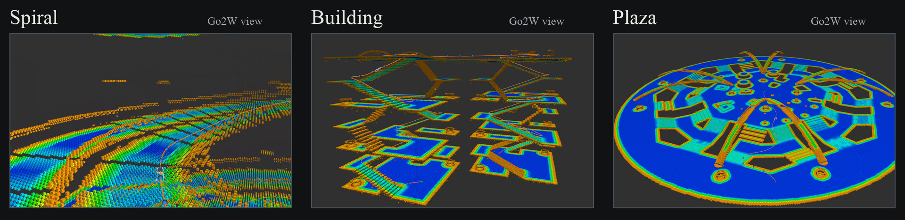
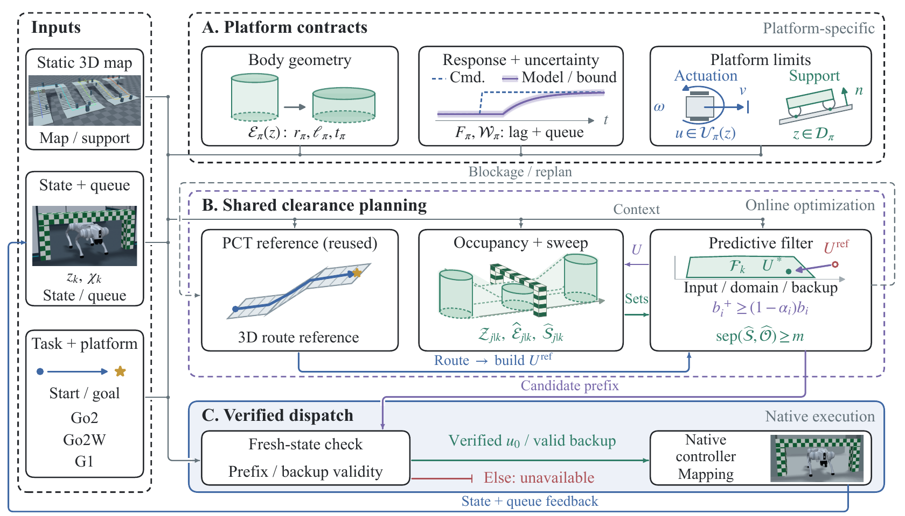
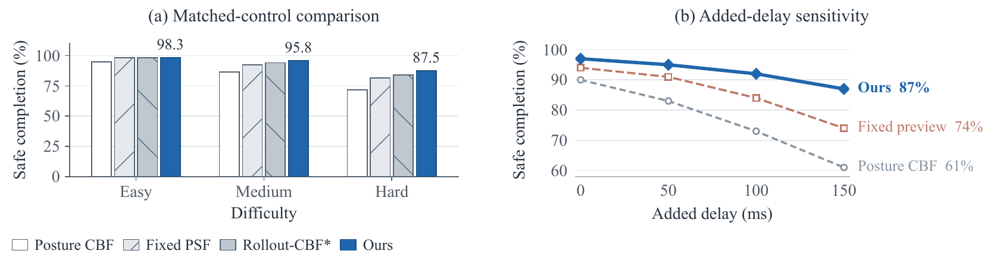

# 3D Clearance Navigation for Ground Robots with Compact Execution-Aware Body Envelopes

**Anonymous supplementary materials**

We coordinate route, posture, and execution to navigate three-dimensional body-clearance constraints.

## Overview

<!-- In the GitHub README editor, attach assets/videos/overview_inline.mp4 on the next line. -->

## Real-Robot Experiments

<!-- Attach assets/videos/three_trial_hardware.mp4 on the next line. -->

Three Go2 recordings show low-clearance navigation and pedestrian crossings. The paper's **85/90** hardware result concerns the gate benchmark; these clips are qualitative examples.

## Cross-Embodiment Simulation

**Go2, Go2W, and G1**

<!-- Attach assets/videos/cross_embodiment.mp4 on the next line. -->

## Method

Platform-specific contracts feed a shared clearance planner, followed by sweep checking and verified dispatch.

<!-- Attach assets/videos/mechanism.mp4 on the next line. -->

## Evaluation

Go2 simulation: **338/360** safe completions. Held-out Go2W and G1 use the shared core with platform calibration. Go2 hardware: **85/90** safe completions.

The source code will be released upon acceptance. [Experiment details](docs/demo_details.md).
